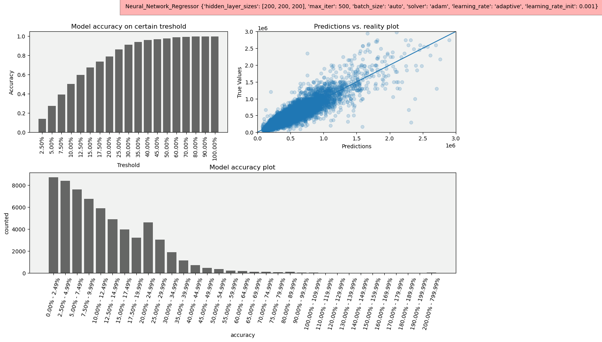
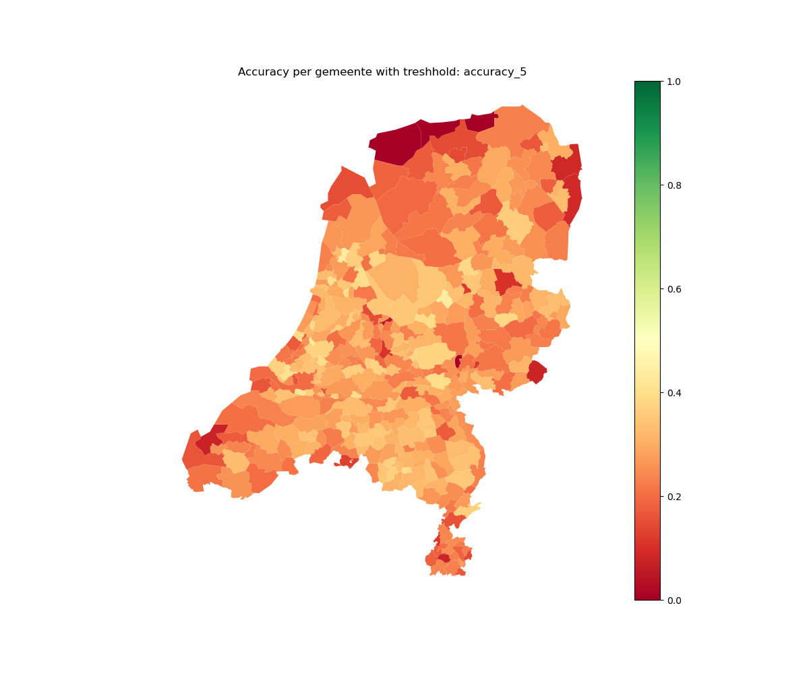
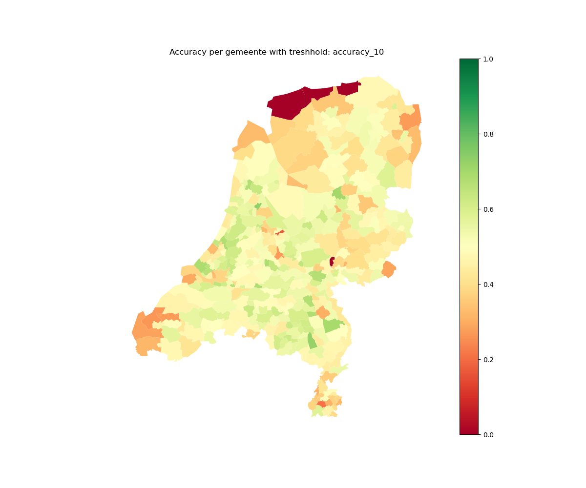

# AI for Business
#### A Pipeline to predict house prices

## Team 2: know_how_to_google
#### Team members: Emmanuel Owusu Annim | Felicia Betten | Robin Kratschmayr | Baris Orman

## Things todo before start:
1. Download the data.zip file in our shared oneDrive. Accesible under this [Link](https://icthva-my.sharepoint.com/:u:/g/personal/baris_orman_hva_nl/EVboGyq1MNdPn-UpxRvaqhsBzHoZh8wxW4it8IKnsm3Dwg?email=r.pinosio%40hva.nl&e=SAJMIx)
2. Unzip the file and place it on the same level as the setup.py in the project folder.
3. Ensure to have the same python Version as in the setup.py file specified. The pipeline does work with other versions but we only guarantee functionality for the specified version.
4. Move in the terminal into the projectfolder and run 'pip install -e .'

## How to set up the config.json

1. If you only want to test the code and all created modules -> set 'demo_mode = true'. This will use the selected parameters but only the first 20.000 lines of the Dataset.
2. To find the best model -> set 'demo_mode = false'. Select the parameters for the models you want to test. Select the data level you want to test on.
3. What does Data level mean?
   - We included extra data beside the funda_2018 housing data.
   - To get more possible relevant information we included:
     - funda_2020: A dataset about sold houses in 2020
     - broker_info: A dataset about information on the housing brokers
     - cbs_info: A dataset with info about the Municpalitys and Districts of the netherlands
     - crime_info: A dataset with more info about the municpalitys regarding to crime
     - tourist_info: A dataset with more info about the municpalitys regarding to tourism
     - pc6: A dataset containing the postcodes of each municipality and neighbourhood in the netherlands to link the data
   - Data level 0:
     - only funda 2018 data
   - Data level 1:
     - only funda 2018 data + Municipality
   - Data level 2:
     - only funda 2018 data + Municipality + district
   - Data level 3:
     - only funda 2018 data + Municipality + district + Neighboorhood
   - Data level 4:
     - funda 2018 data + Municipality + district + Neighboorhood
     - cbs_data
   - Data level 5:
     - funda 2018 data + Municipality + district + Neighboorhood
     - cbs_data
     - funda_2020 data
   - Data level 6:
     - funda 2018 data + Municipality + district + Neighboorhood
     - cbs_data
     - funda_2020 data
     - broker data
4. The preselected parameters are the one that turned out to be our best model. Due to computing power we were not able to test data level above 4.

## How to run the code:
After the above steps are done and the parameters to test are specified, the pipeline can be started. To do so, move into the run folder, where the conf.json and run.py file lays and use the following code to start:
'''
python run.py
'''

## How to interpret the model?
To determine if a model is good or bad we implemented several features. 
While running, the pipeline automatically chooses the best combination of the given parameters by crossvalidating for the lowest Mean Squared Error (RMSE). 

Each run creates a new folder that includes the running date and time in the folder name. (E.g. run_20210119_1237 -> Run on the 19. January 2021 at 12:37h) This folder stores the best Random Forest and Neural Network Model in its subfolder called models as abinary python object that can be loaded with **pickle**. More interesting for evaluating the model is the plots folder. That contains 3 different plots for each best Random Forest and Neural Network model.

1. The Model Overview:
   - This plot contains the choosen parameters for the model in Header and the model RMSE on the predicted value.
   - Furthermore it contains 3 Plots to evaluate the model accuracy
     - The Overall Model Accuracy plot on different thresholds (uper left corner)
       - The X axis shows the threshold and the Y Axis the Accuracy. 
       - E.g. On a 5 % treshold (second bar) the overall Accuracy would be 25%. That means 25% of all predictions hav 5% or less deviation from the real value.
     - The Residuals vs. Fitted plot (upper right corner)
       - This plot shows all predictions on the X axis vs the true values on the Y axis.
     - The Number of predictions in each deviation group.
       - This plot shows the deviation group on the X Axis and the number of predicted values with the given deviation on the Y Axis. 
   - Example: 
   - 
2. The Model accuracy for each gemeente.
    - This plot shows the Model accuracy for each gemeente specified with colors. The greener the map, the better the accuracy based on the specified threshold. The threshold can be read in the header where 'accuracy_5' stands for a 5% threshold and 'accuracy_10' stands for a 10% treshold. 
    - E.g. If a gemente shows a light green on the 10% accuracy plot. About 70% of all houseprices in that gemeente are predicted with a deviation of less then 10 or 10% of the real houseprice.
    - Example: 
    - Example 2: 
